# Panduan Praktikum Doubly Linked List

Dokumen ini berisi penjelasan konsep, diagram visual vektor (SVG), dan pseudocode untuk **11 Operasi Dasar Doubly Linked List** sesuai dengan standar buku ajar Struktur Data.

---

## Pembagian Soal Mahasiswa (33 Soal)

Soal praktikum dibagi menjadi 3 file berdasarkan variasi dataset awal:

| Tipe File | Nomor Soal | Data Awal | Target Pembelajaran |
|---|---|---|---|
| `soal_tipe_A.py` | Soal 01 – 11 | `['A', 'B', 'C']` | Operasi dasar list 3 node |
| `soal_tipe_B.py` | Soal 12 – 22 | `['K', 'L', 'M', 'N']` | Operasi dasar list 4 node |
| `soal_tipe_C.py` | Soal 23 – 33 | `['P', 'Q', 'R', 'S', 'T']` | Operasi dasar list 5 node |

Setiap mahasiswa mengerjakan **1 nomor soal** pada file tipe masing-masing.

---

## Struktur Node & Doubly Linked List

Setiap elemen (node) memiliki 3 bagian/kompartemen: **`[ prev | info | next ]`**

- `prev` : Pointer menunjuk ke node sebelumnya (berisi garis miring `/` jika `NULL` / `nil`).
- `info` : Nilai data yang disimpan pada node (misal huruf `'A'`).
- `next` : Pointer menunjuk ke node sesudahnya (berisi garis miring `/` jika `NULL` / `nil`).

Struktur List **`L`** dikontrol oleh dua pointer utama:
- **`First(L)`** / `dll.first` : Menunjuk elemen pertama pada list.
- **`Last(L)`** / `dll.last` : Menunjuk elemen terakhir pada list.

---

# 11 Operasi Dasar Doubly Linked List

## 1. Insert Empty (Sisip di List Kosong)
Menyisipkan node baru `P` ketika list masih kosong (`First(L) = NULL` dan `Last(L) = NULL`).

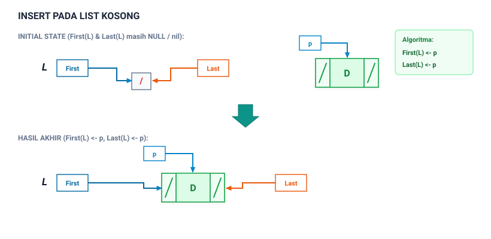

**Pseudocode:**
```pascal
P <- BIKIN_NODE(data)
First(L) <- P
Last(L) <- P
```

---

## 2. Insert First (Sisip di Posisi Paling Depan)
Menyisipkan node baru `P` di posisi paling awal list, lalu memperbarui `First(L)`.

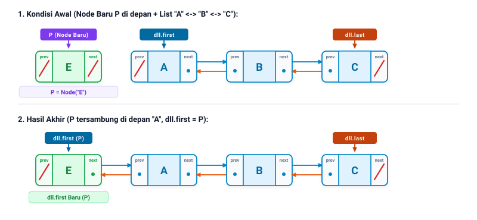

**Pseudocode:**
```pascal
P <- BIKIN_NODE(data)
next(P) <- First(L)
prev(First(L)) <- P
First(L) <- P
```

---

## 3. Insert Last (Sisip di Posisi Paling Belakang)
Menyisipkan node baru `P` di posisi paling akhir list, lalu memperbarui `Last(L)`.

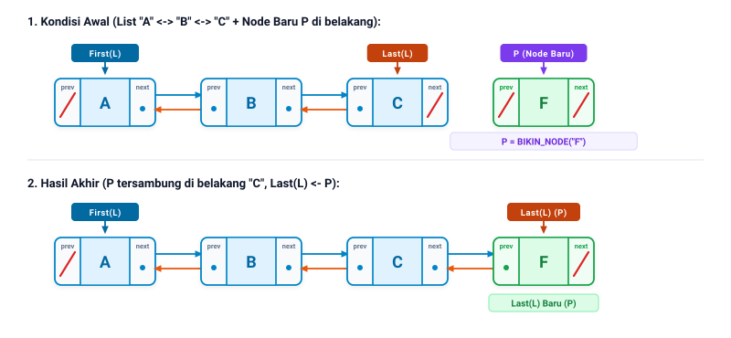

**Pseudocode:**
```pascal
P <- BIKIN_NODE(data)
prev(P) <- Last(L)
next(Last(L)) <- P
Last(L) <- P
```

---

## 4. Insert After Node (Sisip Setelah Node Tertentu)
Menyisipkan node baru `P` tepat setelah node target (`target`), dengan bantuan pointer `Q` sebagai elemen berikutnya (`next(target)`).

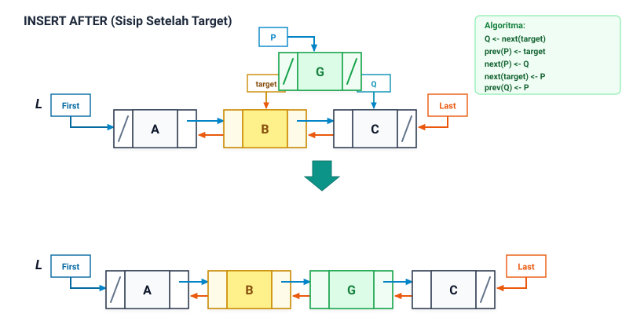

**Pseudocode:**
```pascal
P <- BIKIN_NODE(data)
Q <- next(target)

prev(P) <- target
next(P) <- Q
next(target) <- P
prev(Q) <- P
```

---

## 5. Insert Before Node (Sisip Sebelum Node Tertentu)
Menyisipkan node baru `P` tepat sebelum node target (`target`), dengan bantuan pointer `Q` sebagai elemen sebelumnya (`prev(target)`).

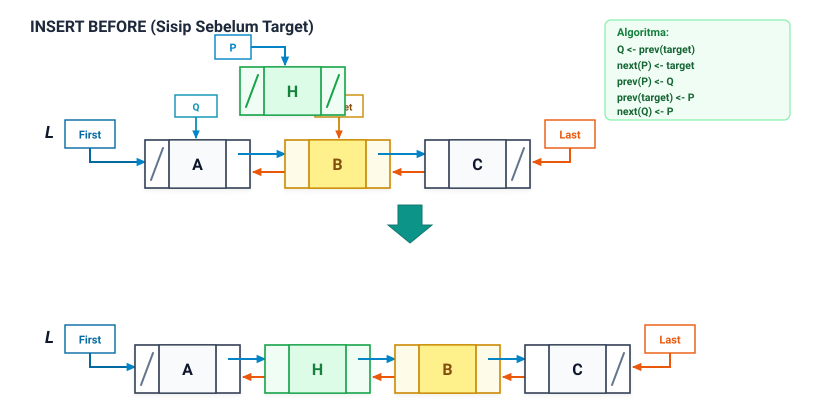

**Pseudocode:**
```pascal
P <- BIKIN_NODE(data)
Q <- prev(target)

next(P) <- target
prev(P) <- Q
prev(target) <- P
next(Q) <- P
```

---

## 6. Traverse Maju (Penelusuran First ke Last)
Menelusuri setiap elemen dari depan ke belakang menggunakan pointer penelusur `P` melalui `next(P)` hingga mencapai `NULL`.

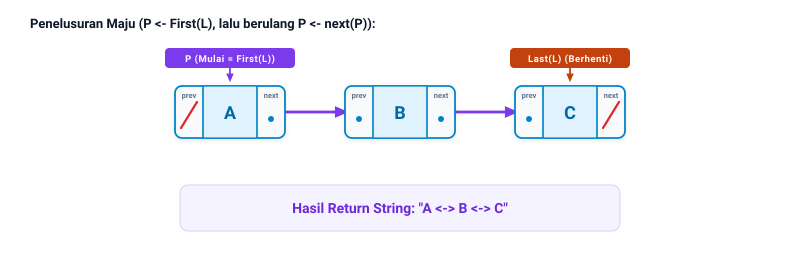

**Pseudocode:**
```pascal
hasil <- ""
P <- First(L)
WHILE P != NULL DO
    hasil <- GABUNG_STRING(hasil, info(P))
    P <- next(P)
ENDWHILE
RETURN hasil
```

---

## 7. Traverse Mundur (Penelusuran Last ke First)
Menelusuri setiap elemen dari belakang ke depan menggunakan pointer penelusur `P` melalui `prev(P)` hingga mencapai `NULL`.

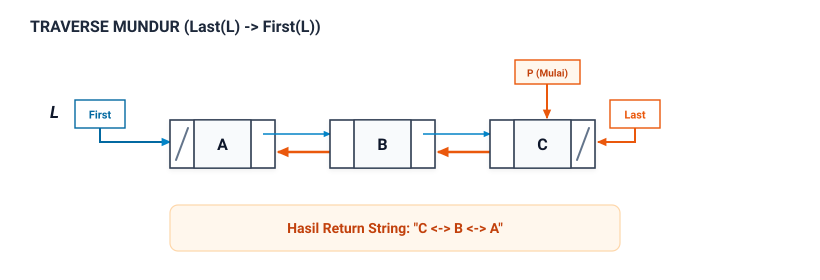

**Pseudocode:**
```pascal
hasil <- ""
P <- Last(L)
WHILE P != NULL DO
    hasil <- GABUNG_STRING(hasil, info(P))
    P <- prev(P)
ENDWHILE
RETURN hasil
```

---

## 8. Search Node (Pencarian Nilai)
Menelusuri list dari `First(L)` menggunakan pointer `P` untuk mencari node dengan nilai tertentu, lalu mengembalikan objek nodenya.

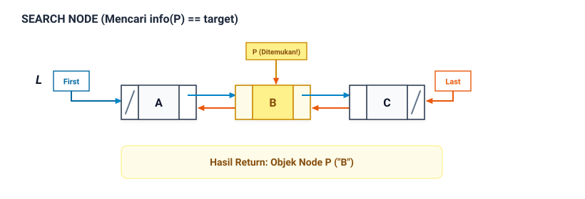

**Pseudocode:**
```pascal
P <- First(L)
WHILE P != NULL DO
    IF info(P) == target THEN
        RETURN P
    ENDIF
    P <- next(P)
ENDWHILE
RETURN NULL
```

---

## 9. Delete First (Hapus Node Paling Depan)
Menghapus node pertama dengan memindahkan `First(L)` ke elemen berikutnya dan memutus hubungan `prev(First(L))`.

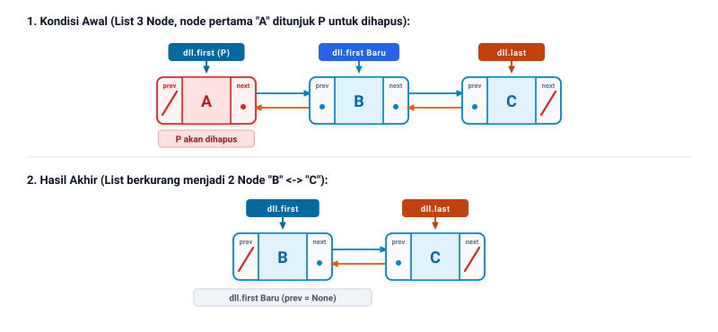

**Pseudocode:**
```pascal
P <- First(L)
First(L) <- next(First(L))
prev(First(L)) <- NULL
HAPUS_NODE(P)
```

---

## 10. Delete Last (Hapus Node Paling Belakang)
Menghapus node terakhir dengan memindahkan `Last(L)` ke elemen sebelumnya dan memutus hubungan `next(Last(L))`.

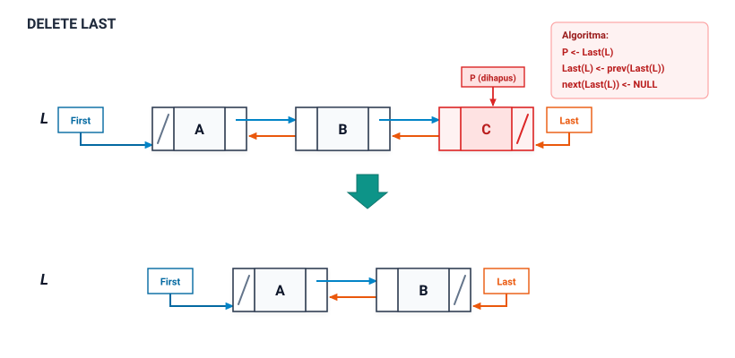

**Pseudocode:**
```pascal
P <- Last(L)
Last(L) <- prev(Last(L))
next(Last(L)) <- NULL
HAPUS_NODE(P)
```

---

## 11. Delete Node (Hapus Node di Tengah)
Menghapus node target di tengah dengan menggunakan pointer `P` (`prev(target)`) dan `Q` (`next(target)`), lalu menghubungkan `P` dan `Q` secara langsung.

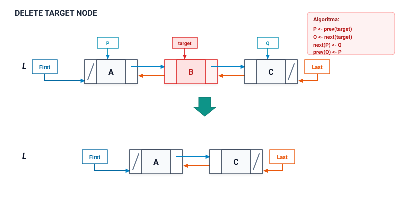

**Pseudocode:**
```pascal
P <- prev(target)
Q <- next(target)

next(P) <- Q
prev(Q) <- P
HAPUS_NODE(target)
```

---

## Format Validasi Output Terminal

Setiap pengujian fungsi mahasiswa akan mencetak status di terminal:

```text
soal 01 Insert Empty Node (Nama NIM) hasil : D [sesuai, info: berhasil]
soal 01 Insert Empty Node (Nama NIM) hasil : None (tidak sesuai, ekspektasi: D)
soal 01 Insert Empty Node (Nama NIM) hasil : ERROR (tidak sesuai, keterangan / eror: AttributeError: ...)
```